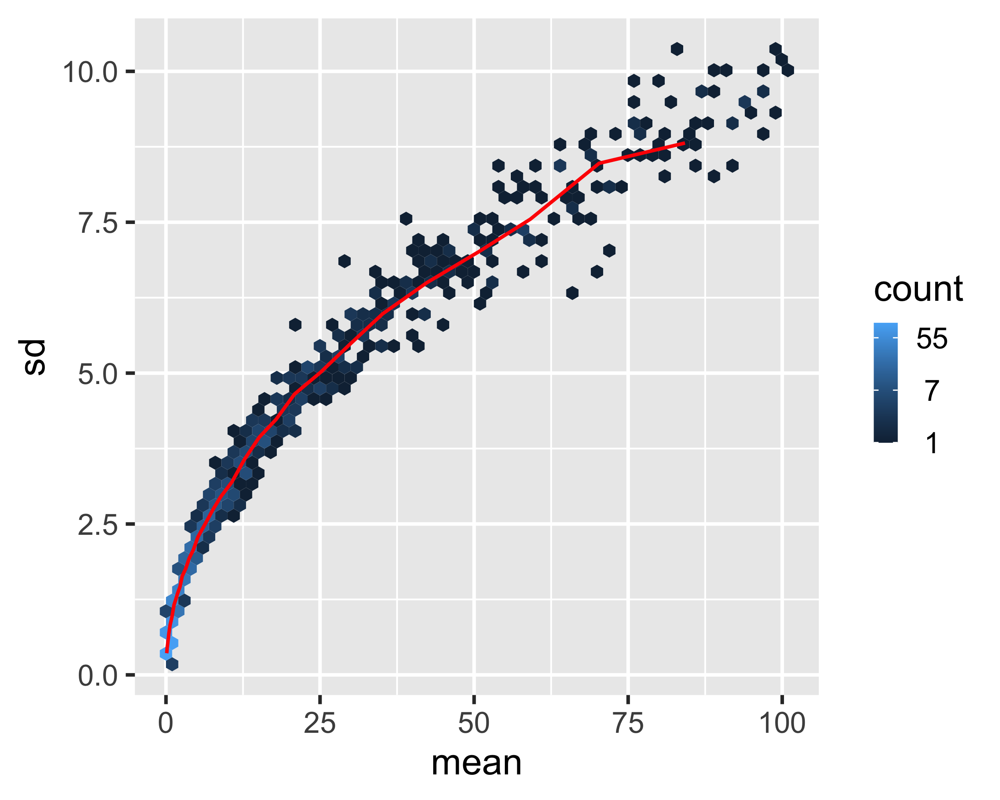
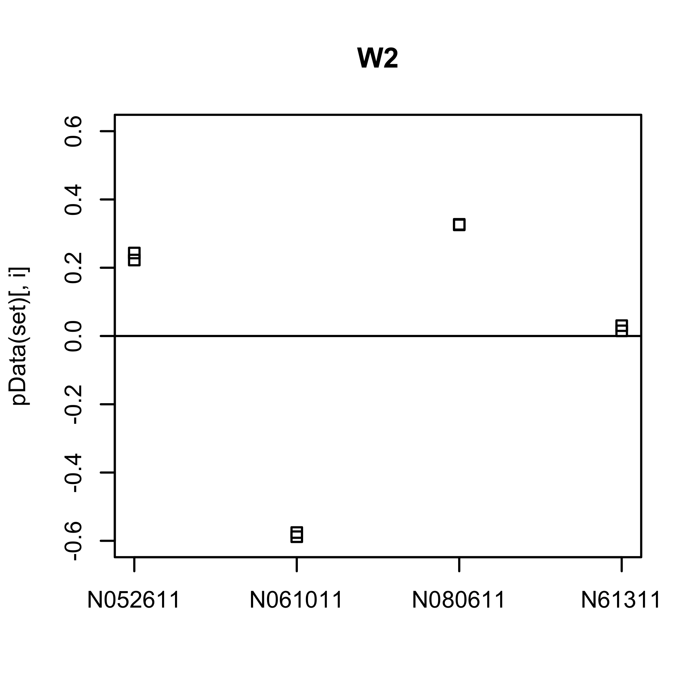

This RNA-seq pipeline is based on a [Bioconductor RNA-seq workflow](https://www.bioconductor.org/packages/devel/workflows/vignettes/rnaseqGene/inst/doc/rnaseqGene.html) with some changes and additions made by myself. These inclusions are to help get the pipeline up and running on MacOS, and include some of the following:

* Installing Homebrew, a package manager used to install necessary software packages
* Installing the newest version of Bash and setting it up
* zsh environment setup
* Miniconda installation (a package/library manager for Python/R)
* Salmon installation (command line tool for RNA-seq reads alignment and quantification)
* SRA tookit installation (a tool from NCBI for downloading RNA-seq data quickly and conveniently) and short guide for downloading multiple fastq files consecutively using a Bash script
* Using the downloaded fastq files to analyse RNA-seq data instead of using the already-processed filed contained in the "airway" R package as described in the Bioconductor RNA-seq workflow
* Using RSelenium to automatically download the necessary sample information from the NCBI website
* Plots are exported as high-resolution image files with appropriately scaled features such as easily-readable text

Not included are all of the analysis details that are included in the [original tutorial](https://www.bioconductor.org/packages/devel/workflows/vignettes/rnaseqGene/inst/doc/rnaseqGene.html). This markdown file simply focusses on getting a pipeline up and running on a Mac computer with real data files.

### 1.0 - Set up environment and tools

#### 1.1 - Install [Homebrew](https://brew.sh/)

Install Homebrew (Mac Terminal):
``` {homebrew-install}
/bin/bash -c "$(curl -fsSL https://raw.githubusercontent.com/Homebrew/install/HEAD/install.sh)"
```

#### 1.2 - Install Bash

Mac comes pre-installed with an old version of bash, so we need to use a newly updated version of Bash using the following steps.

Install the latest Bash using Homebrew (Mac Terminal):

``` {bash-install}
brew install bash
```

Show all bash installs (Mac terminal):
``` {which-bash}
which -a bash
```

Change the default bash shell to most recent Homebrew install (Mac terminal):
``` {change-bash}
chsh -s /usr/local/bin/bash
```

Check which bash version is being used (Mac terminal):
``` {bash-version}
bash --version
```

If the bash version now being used looks recent, and not from 2007 for example, you're good to go.

#### 1.3 - Update .zshrc and .zprofile:

If you want, you can install [Oh-My-Zsh](https://ohmyz.sh/#install), which generates a .zshrc file in the home directory and can also be used to make the terminal look nice (Mac terminal):
``` {omz-install}
sh -c "$(curl -fsSL https://raw.github.com/ohmyzsh/ohmyzsh/master/tools/install.sh)"
```

Alternatively, just create a .zshrc file without installing Oh My Zsh (Mac terminal):
``` {zshrc}
touch ~/.zshrc
```

Generate .zprofile file in the home directory (Oh My Zsh does not do this for you) (Mac terminal):
```{zprofile}
touch ~/.zprofile
```

#### 1.4 - Install [Miniconda](https://bioconda.github.io/user/install.html)

Note: Miniconda can potentially cause problems with your Python installs (both Python 2 & 3).

Install miniconda with the following command (Mac terminal):
``` {install-miniconda}
curl -O https://repo.anaconda.com/miniconda/Miniconda3-latest-MacOSX-x86_64.sh
sh Miniconda3-latest-MacOSX-x86_64.sh
```

Add the following to .zprofile (change username to your own):
``` {conda-zprofile}
export PATH="/Users/username/miniconda3/bin/conda:$PATH"
```

Install bioconda after miniconda (Mac terminal):
``` {install-bioconda}
conda config --add channels defaults
conda config --add channels bioconda
conda config --add channels conda-forge
```

Install [Salmon using miniconda](https://anaconda.org/bioconda/salmon) (Mac terminal):
``` {install-salmon}
conda install -c bioconda salmon
```

#### 1.5 - Install SRA toolkit

[SRA toolkit](https://github.com/ncbi/sra-tools/wiki/02.-Installing-SRA-Toolkit) will allow us to download publicly available data i.e. fastq files).

Install the SRA toolkit using the following commands (Mac terminal):
``` {curl-sratoolkit}
curl -L --output sratoolkit.tar.gz
http://ftp-trace.ncbi.nlm.nih.gov/sra/sdk/current/sratoolkit.current-mac64.tar.gz
tar -vxzf sratoolkit.tar.gz
```

Add the following to your .zshrc file and save (replace username with your own):
``` {export-sra-zshrc}
export PATH="/Users/username/sratoolkit.2.11.1-mac64/bin:$PATH"
```

Verify that the binaries will be found by the shell (Mac terminal):
``` {which-fastq-dump}
which fastq-dump
```

The above command should return the following output (username is your user name):
``` {which-fastq-dump-output}
/Users/username/sratoolkit.2.11.1-mac64/bin/fastq-dump
```

Follow [instructions from the quick tool-kit configuration](https://github.com/ncbi/sra-tools/wiki/03.-Quick-Toolkit-Configuration). Note that you do not need to be paying for a cloud service to download files. Just set "report cloud instance identity" for both cloud services specified.

Test that the toolkit is functional (Mac terminal):
``` {sra-toolkit-test}
fastq-dump --stdout SRR390728 | head -n 8
```

The above command should return the following data to demonstrate that the SRA toolkit is functional:
```{sra-toolkit-test-output}
@SRR390728.1 1 length=72
CATTCTTCACGTAGTTCTCGAGCCTTGGTTTTCAGCGATGGAGAATGACTTTGACAAGCTGAGAGAAGNTNC
+SRR390728.1 1 length=72
;;;;;;;;;;;;;;;;;;;;;;;;;;;9;;665142;;;;;;;;;;;;;;;;;;;;;;;;;;;;;96&&&&(
@SRR390728.2 2 length=72
AAGTAGGTCTCGTCTGTGTTTTCTACGAGCTTGTGTTCCAGCTGACCCACTCCCTGGGTGGGGGGACTGGGT
+SRR390728.2 2 length=72
;;;;;;;;;;;;;;;;;4;;;;3;393.1+4&&5&&;;;;;;;;;;;;;;;;;;;;;<9;<;;;;;464262
fastq-dump was killed (signal 13 SIGPIPE)
```

### 2.0 - Preparing quantification input to DESeq2

#### 2.1 - Prepare transcriptome

The following Salmon pipeline is based on the ['Getting Started' pipeline](https://combine-lab.github.io/salmon/getting_started/) on the Salmon website.

Make a working directory called 'biocond-workflow' and download the human transcriptome (i.e. cDNA) (Mac terminal):
``` {dl-cdna}
mkdir biocond-workflow
cd biocond-workflow
curl ftp://ftp.ensembl.org/pub/release-95/fasta/homo_sapiens/cdna/Homo_sapiens.GRCh38.cdna.all.fa.gz -o human.fa.gz
```

Index the downloaded transcriptome using Salmon (Mac terminal):
``` {index-cdna}
salmon index -t human.fa.gz -i human_index
```

From the [relevant Gene Expression Omnibus (GEO) entry](https://www.ncbi.nlm.nih.gov/geo/query/acc.cgi?acc=GSM1275862), click on [SRA run selector](https://www.ncbi.nlm.nih.gov/Traces/study/?acc=PRJNA524182&o=acc_s%3Aa).

Create a Bash script called 'dl-reads.sh' (Mac terminal):
```{touch-dl-reads}
touch dl-reads.sh
```

Open the 'dl-reads.sh' script using a text editor and add the following code
which will download all the fastq files to a subdirectory called 'data':
``` {fasterq-dump}
#!/usr/local/bin/bash
mkdir data
cd data
vdb-config --prefetch-to-cwd
for i in {08..23}; 
do
  prefetch SRR10395${i};
  fasterq-dump SRR10395${i};
  mv SRR10395${i}_1.fastq SRR10395${i};
  mv SRR10395${i}_2.fastq SRR10395${i};
done
cd ..
```

Run the 'dl-reads.sh' script, which will download 172.18GB of fastq files. This will take
a considerable amount of time depending on your internet connection (~8 hrs on a 50 Mbit/sec connection):
```{bash-dl-reads}
bash dl-reads.sh
```

Create a Bash script called 'align-reads.sh' (Mac terminal):
```{touch-align-reads}
touch align-reads.sh
```

Open the 'align-reads.sh' script using a text editor and add the following code:
``` {align-reads}
#!/usr/local/bin/bash
for fn in SRR10395{08..23};
do
    samp=`basename ${fn}`
    echo "Processing sample ${samp}"
    salmon quant -i human_index -l A -p 10 --validateMappings \
    --gcBias --numGibbsSamples 20 -o transcripts_quant/${fn} \
    -1 data/${fn}/${samp}_1.fastq \
    -2 data/${fn}/${samp}_2.fastq
done
```

Run the 'align-reads.sh' script, which will align each of the fastq read files to the human genome file we indexed earlier. This will take some time:
```{bash-dl-reads}
bash dl-reads.sh
```

### 3.0 - Run the R Script Analysis

#### 3.1 - Download data information table from NCBI

Use RSelenium to download the data table from NCBI:
```{r-selenium-table}
library(rvest)
library(RSelenium)
library(tidyverse)
url <- "https://www.ncbi.nlm.nih.gov/Traces/study/?acc=PRJNA229998&o=acc_s%3Aa"

rD <- rsDriver(browser="firefox", port=4545L, verbose=F)
remDr <- rD[["client"]]

# Find a free port if getting errors regarding ports already in use for the above lines.
# library(netstat)
# rsDriver(verbose = FALSE, port=free_port())

# Load the appropriate url:
remDr$navigate(url)
Sys.sleep(15) # Load the page
html <- remDr$getPageSource()[[1]]

# Close the client once html obtained
remDr$close()
rD$server$stop()
rm(rD, remDr)
gc()

# Get the information table from the NCBI page:
info_table <- read_html(html) %>% html_nodes("table.ui.selectable.striped.celled.very.compact.table.single.line") %>% .[3] %>% html_table() %>% .[[1]]

# Remove the first column:
info_table <- info_table[,2:ncol(info_table)]

# Rename the columns:
new_colnames <- c()
for (columns in colnames(info_table)) {
  new_name <- gsub('[[:digit:]]+', '', columns)
  new_colnames <- c(new_colnames, new_name)
}
colnames(info_table) <- new_colnames

```

Set the working directory:
```{r-quant-files}
dir <- "~/biocond-RNA-seq/salmon"
list.files(file.path(dir, "transcripts_quant"))

# R console output:
# [1] "SRR1039508" "SRR1039509" "SRR1039510" "SRR1039511" "SRR1039512" "SRR1039513" "SRR1039514" "SRR1039515"
# [9] "SRR1039516" "SRR1039517" "SRR1039518" "SRR1039519" "SRR1039520" "SRR1039521" "SRR1039522" "SRR1039523"
```

Process the data table so that it can be used to correctly process files further down the pipeline. Ensure the colnames dataframe has strings imported as factors (stringsAsFactors = TRUE):
```{r-coldata}
info_table$names <- coldata$Run
info_table$files <- file.path(dir, "transcripts_quant", info_table$names, "quant.sf")

dex_vector <- c()
albut_vector <- c()
for (i_0 in info_table$treatment) {
    if (i_0 == "Untreated") {
        dex_vector <- c(dex_vector, "untrt")
        albut_vector <- c(albut_vector, "untrt")
    } else if (i_0 == "Dexamethasone") {
        dex_vector <- c(dex_vector, "trt")
        albut_vector <- c(albut_vector, "untrt")
    } else if (i_0 == "Albuterol") {
        dex_vector <- c(dex_vector, "untrt")
        albut_vector <- c(albut_vector, "trt")        
    } else {
        dex_vector <- c(dex_vector, "trt")
        albut_vector <- c(albut_vector, "trt")          
    }
}

full_coldata <- data.frame(SampleName = info_table$GEO_Accession,
                       cell = info_table$Cell_Line,
                       dex = dex_vector,
                       albut = albut_vector,
                       Run = info_table$Run,
                       avgLength = info_table$AvgSpotLen,
                       Experiment = info_table$Experiment,
                       Sample = "NA",
                       BioSample = info_table$BioSample,
                       names = info_table$names,
                       files = info_table$files,
                       stringsAsFactors = TRUE)

# Take only the data that we're interested in:
run_subset <- c("SRR1039508",
                "SRR1039509",
                "SRR1039512",
                "SRR1039513",
                "SRR1039516",
                "SRR1039517",
                "SRR1039520",
                "SRR1039521")

coldata <- full_coldata[which(full_coldata$Run %in% run_subset),]
                        
# Show that file paths in coldata exist:
for (i_0 in coldata$files) {
    print(paste0(i_0, ": ", (file.exists(i_0))))
}

# R console output:
# [1] "~/biocond-RNA-seq/salmon/transcripts_quant/SRR1039508/quant.sf: TRUE"
# [1] "~/biocond-RNA-seq/salmon/transcripts_quant/SRR1039509/quant.sf: TRUE"
# [1] "~/biocond-RNA-seq/salmon/transcripts_quant/SRR1039510/quant.sf: TRUE"
# [1] "~/biocond-RNA-seq/salmon/transcripts_quant/SRR1039511/quant.sf: TRUE"
# [1] "~/biocond-RNA-seq/salmon/transcripts_quant/SRR1039512/quant.sf: TRUE"
# [1] "~/biocond-RNA-seq/salmon/transcripts_quant/SRR1039513/quant.sf: TRUE"
# [1] "~/biocond-RNA-seq/salmon/transcripts_quant/SRR1039514/quant.sf: TRUE"
# [1] "~/biocond-RNA-seq/salmon/transcripts_quant/SRR1039515/quant.sf: TRUE"
# [1] "~/biocond-RNA-seq/salmon/transcripts_quant/SRR1039516/quant.sf: TRUE"
# [1] "~/biocond-RNA-seq/salmon/transcripts_quant/SRR1039517/quant.sf: TRUE"
# [1] "~/biocond-RNA-seq/salmon/transcripts_quant/SRR1039518/quant.sf: TRUE"
# [1] "~/biocond-RNA-seq/salmon/transcripts_quant/SRR1039519/quant.sf: TRUE"
# [1] "~/biocond-RNA-seq/salmon/transcripts_quant/SRR1039520/quant.sf: TRUE"
# [1] "~/biocond-RNA-seq/salmon/transcripts_quant/SRR1039521/quant.sf: TRUE"
# [1] "~/biocond-RNA-seq/salmon/transcripts_quant/SRR1039522/quant.sf: TRUE"
# [1] "~/biocond-RNA-seq/salmon/transcripts_quant/SRR1039523/quant.sf: TRUE"
```

#### R: Reading in data with tximeta

```{r-tximeta}
# BiocManager::install("tximeta")
library(tximeta)
# BiocManager::install("SummarizedExperiment")
library(SummarizedExperiment)

# Converts strings to factors for upcoming steps:
coldata[sapply(coldata, is.character)] <- lapply(coldata[sapply(coldata, is.character)], as.factor)

se <- tximeta(coldata)

# R console output:
# importing quantifications
# reading in files with read_tsv
# 1 2 3 4 5 6 7 8 
# found matching transcriptome:
# [ Ensembl - Homo sapiens - release 95 ]
# loading existing EnsDb created: 2021-10-04 07:42:30
# loading existing transcript ranges created: 2021-10-04 07:42:33
```

```{r-dimse}
dim(se)

# R console output:
# [1] 175775      8
```

```{r-head-rownames-se}
head(rownames(se))

# R console output:
# [1] "ENST00000632684" "ENST00000434970" "ENST00000448914" "ENST00000415118" "ENST00000390583" "ENST00000390577"
```

```{r-gse}
gse <- summarizeToGene(se)

# R console output:
# loading existing EnsDb created: 2021-10-04 07:42:30
# obtaining transcript-to-gene mapping from database
# loading existing gene ranges created: 2021-10-04 07:48:48
# summarizing abundance
# summarizing counts
# summarizing length
# summarizing inferential replicates
```

```{r-dim-gse}
dim(gse)

# R console output:
# [1] 37788     8
```

```{r-head-rownames-gse}
head(rownames(gse))

# R console output:
# [1] "ENSG00000000003" "ENSG00000000005" "ENSG00000000419" "ENSG00000000457" "ENSG00000000460" "ENSG00000000938"
```

```{r-data-gse}
data(gse)
gse

# R console output:
# class: RangedSummarizedExperiment 
# dim: 37788 8 
# metadata(6): tximetaInfo quantInfo ... txomeInfo txdbInfo
# assays(23): counts abundance ... infRep19 infRep20
# rownames(37788): ENSG00000000003 ENSG00000000005 ... ENSG00000285990 ENSG00000285991
# rowData names(9): gene_id gene_name ... entrezid tx_ids
# colnames(8): SRR1039508 SRR1039509 ... SRR1039520 SRR1039521
# colData names(10): SampleName cell ... BioSample names
```

```{r-assaynames-gse}
assayNames(gse)

# R console output:
#  [1] "counts"    "abundance" "length"    "infRep1"   "infRep2"   "infRep3"   "infRep4"   "infRep5"   "infRep6"  
# [10] "infRep7"   "infRep8"   "infRep9"   "infRep10"  "infRep11"  "infRep12"  "infRep13"  "infRep14"  "infRep15" 
# [19] "infRep16"  "infRep17"  "infRep18"  "infRep19"  "infRep20" 
```

```{r-head-assay-gse}
head(assay(gse), 3)

# R console output:
#                 SRR1039508 SRR1039509 SRR1039512 SRR1039513 SRR1039516 SRR1039517 SRR1039520 SRR1039521
# ENSG00000000003    716.187    478.938    909.886    431.596   1197.728   1097.257    811.445    610.979
# ENSG00000000005      0.000      0.000      0.000      0.000      0.000      0.000      0.000      0.000
# ENSG00000000419    458.000    512.000    610.000    354.684    582.088    780.974    413.128    502.967
```

```{r-colsums-assay-gse}
colSums(assay(gse))

# R console output:
# SRR1039508 SRR1039509 SRR1039512 SRR1039513 SRR1039516 SRR1039517 SRR1039520 SRR1039521 
#   21191732   19427877   26176444   15739827   25254247   31921933   19733070   21884786
```

```{r-rownames-gse}
rowRanges(gse)

# R console output:
# GRanges object with 37788 ranges and 9 metadata columns:
#                   seqnames              ranges strand |         gene_id   gene_name           gene_biotype
#                      <Rle>           <IRanges>  <Rle> |     <character> <character>            <character>
#   ENSG00000000003        X 100627109-100639991      - | ENSG00000000003      TSPAN6         protein_coding
#   ENSG00000000005        X 100584802-100599885      + | ENSG00000000005        TNMD         protein_coding
#   ENSG00000000419       20   50934867-50958555      - | ENSG00000000419        DPM1         protein_coding
#   ENSG00000000457        1 169849631-169894267      - | ENSG00000000457       SCYL3         protein_coding
#   ENSG00000000460        1 169662007-169854080      + | ENSG00000000460    C1orf112         protein_coding
#               ...      ...                 ...    ... .             ...         ...                    ...
#   ENSG00000285978        5 178694605-178729335      - | ENSG00000285978  AC113348.2         protein_coding
#   ENSG00000285982        8 103398658-103501895      - | ENSG00000285982  AC012213.5         protein_coding
#   ENSG00000285986        1 196850283-196884793      + | ENSG00000285986  BX248415.1 unprocessed_pseudogene
#   ENSG00000285990       14   19244904-19269380      - | ENSG00000285990  AL589743.7 transcribed_unproces..
#   ENSG00000285991        6 149817937-149896011      - | ENSG00000285991  AL355312.5         protein_coding
#                   seq_coord_system            description    gene_id_version      symbol entrezid
#                        <character>            <character>        <character> <character>   <list>
#   ENSG00000000003       chromosome tetraspanin 6 [Sourc.. ENSG00000000003.14      TSPAN6     7105
#   ENSG00000000005       chromosome tenomodulin [Source:..  ENSG00000000005.5        TNMD    64102
#   ENSG00000000419       chromosome dolichyl-phosphate m.. ENSG00000000419.12        DPM1     8813
#   ENSG00000000457       chromosome SCY1 like pseudokina.. ENSG00000000457.13       SCYL3    57147
#   ENSG00000000460       chromosome chromosome 1 open re.. ENSG00000000460.16    C1orf112    55732
#               ...              ...                    ...                ...         ...      ...
#   ENSG00000285978       chromosome       novel transcript  ENSG00000285978.1  AC113348.2     <NA>
#   ENSG00000285982       chromosome          novel protein  ENSG00000285982.1  AC012213.5     <NA>
#   ENSG00000285986       chromosome complement factor H ..  ENSG00000285986.1  BX248415.1     <NA>
#   ENSG00000285990       chromosome neurobeachin (NBEA) ..  ENSG00000285990.1  AL589743.7     <NA>
#   ENSG00000285991       chromosome       novel transcript  ENSG00000285991.1  AL355312.5     <NA>
#                                                                tx_ids
#                                                       <CharacterList>
#   ENSG00000000003 ENST00000373020,ENST00000494424,ENST00000496771,...
#   ENSG00000000005                     ENST00000373031,ENST00000485971
#   ENSG00000000419 ENST00000371582,ENST00000371584,ENST00000371588,...
#   ENSG00000000457 ENST00000367770,ENST00000367771,ENST00000367772,...
#   ENSG00000000460 ENST00000286031,ENST00000359326,ENST00000413811,...
#               ...                                                 ...
#   ENSG00000285978                                     ENST00000638723
#   ENSG00000285982                                     ENST00000649416
#   ENSG00000285986                                     ENST00000649395
#   ENSG00000285990                                     ENST00000649331
#   ENSG00000285991                                     ENST00000647612
#   -------
#   seqinfo: 423 sequences from GRCh38 genome
```

```{r-seqinfo-rowranges-gse}
seqinfo(rowRanges(gse))

# R console output:
# Seqinfo object with 423 sequences from GRCh38 genome:
#   seqnames seqlengths isCircular genome
#   1         248956422      FALSE GRCh38
#   10        133797422      FALSE GRCh38
#   11        135086622      FALSE GRCh38
#   12        133275309      FALSE GRCh38
#   13        114364328      FALSE GRCh38
#   ...             ...        ...    ...
#   LRG_763      176286      FALSE GRCh38
#   LRG_93        22459      FALSE GRCh38
#   MT            16569      FALSE GRCh38
#   X         156040895      FALSE GRCh38
#   Y          57227415      FALSE GRCh38
```

```{r-coldata-gse}
colData(gse)

# R console output:
#            SampleName     cell      dex    albut        Run avgLength Experiment   Sample    BioSample      names
#              <factor> <factor> <factor> <factor>   <factor> <integer>   <factor> <factor>     <factor>   <factor>
# SRR1039508 GSM1275862  N61311     untrt    untrt SRR1039508       126  SRX384345       NA SAMN02422669 SRR1039508
# SRR1039509 GSM1275863  N61311     trt      untrt SRR1039509       126  SRX384346       NA SAMN02422675 SRR1039509
# SRR1039512 GSM1275866  N052611    untrt    untrt SRR1039512       126  SRX384349       NA SAMN02422678 SRR1039512
# SRR1039513 GSM1275867  N052611    trt      untrt SRR1039513        87  SRX384350       NA SAMN02422670 SRR1039513
# SRR1039516 GSM1275870  N080611    untrt    untrt SRR1039516       120  SRX384353       NA SAMN02422682 SRR1039516
# SRR1039517 GSM1275871  N080611    trt      untrt SRR1039517       126  SRX384354       NA SAMN02422673 SRR1039517
# SRR1039520 GSM1275874  N061011    untrt    untrt SRR1039520       101  SRX384357       NA SAMN02422683 SRR1039520
# SRR1039521 GSM1275875  N061011    trt      untrt SRR1039521        98  SRX384358       NA SAMN02422677 SRR1039521
```

### 3.0 - The DESeqDataSet object, sample information and the design formula

```{r-gse-donor}
gse$cell

# R console output:
# [1] N61311  N61311  N052611 N052611 N080611 N080611 N061011 N061011
# Levels: N052611 N061011 N080611 N61311
```

```{r-gse-condition}
# Re-order levels so that 'untreated' comes before 'treated':
library("magrittr")
gse$dex %<>% relevel("untrt")
gse$dex

# R console output:
# [1] untrt trt   untrt trt   untrt trt   untrt trt  
# Levels: trt untrt
```

#### 3.1 - Starting from SummarizedExperiment

```{r-round-colsums-assay-gse}
round(colSums(assay(gse)) / 1e6, 1 )

# R console output:
# SRR1039508 SRR1039509 SRR1039512 SRR1039513 SRR1039516 SRR1039517 SRR1039520 SRR1039521 
#       21.2       19.4       26.2       15.7       25.3       31.9       19.7       21.9 
```

```{r-deseq2-dds}
# BiocManager::install("DESeq2")
library("DESeq2")
dds <- DESeqDataSet(gse, design = ~ cell + dex)

# R console output:
# using counts and average transcript lengths from tximeta
```

#### 3.2 - Starting from count matrices

```{r-countdata-head}
countdata <- round(assays(gse)[["counts"]])
head(countdata, 3)

# R console output:
#                 SRR1039508 SRR1039509 SRR1039512 SRR1039513 SRR1039516 SRR1039517 SRR1039520 SRR1039521
# ENSG00000000003        716        479        910        432       1198       1097        811        611
# ENSG00000000005          0          0          0          0          0          0          0          0
# ENSG00000000419        458        512        610        355        582        781        413        503
```

```{r-coldata-ddsmat}
coldata <- colData(gse)

ddsMat <- DESeqDataSetFromMatrix(countData = countdata,
                                 colData = coldata,
                                 design = ~ cell + dex)

# R console output:
# converting counts to integer mode
```

### 4.0 - Exploratory analysis and visualization

#### 4.1 - Pre-filtering the dataset

```{r-nrow-dds}
nrow(dds)

# [1] 37788
```

```{r-keep-dds-nrow}
keep <- rowSums(counts(dds)) > 1
dds <- dds[keep,]
nrow(dds)

# R console output:
# [1] 22456
```


```{r-keep-rowsums}
# at least 3 samples with a count of 10 or higher
keep <- rowSums(counts(dds) >= 10) >= 3
```

#### 4.2 - The variance stabilizing transformation and the rlog

```{r-lambda-vsn}
lambda <- 10^seq(from = -1, to = 2, length = 1000)
cts <- matrix(rpois(1000*100, lambda), ncol = 100)
# BiocManager::install("vsn")
library("vsn")

# 1. Open file
png("4-2_mean-sd-plot.png",
    width=2500,
    height=2000,
    res=600,
    pointsize = 5)
# 2. Create the plot
meanSdPlot(cts,
           ranks = FALSE)
# 3. Close the file
dev.off()
```



```{r-log-cts-one}
# Plot
log.cts.one <- log2(cts + 1)

# 1. Open file
png("4-2_mean-sd-plot-log.png",
    width=2500,
    height=2000,
    res=600,
    pointsize = 5)
# 2. Create the plot
meanSdPlot(log.cts.one,
           ranks = FALSE)
# 3. Close the file
dev.off()
```


```{r-assay-head-vsd}
vsd <- vst(dds, blind = FALSE)
head(assay(vsd), 3)

# R console output:
#                 SRR1039508 SRR1039509 SRR1039512 SRR1039513 SRR1039516 SRR1039517 SRR1039520 SRR1039521
# ENSG00000000003  10.133815   9.897295  10.212515  10.033401  10.465380  10.227153  10.351200  10.044104
# ENSG00000000419   9.726928   9.949328   9.848558   9.837654   9.801950   9.907174   9.727829   9.879776
# ENSG00000000457   9.523130   9.381085   9.448618   9.532008   9.361936   9.472110   9.552577   9.519802
```

```{r-coldata-vsd}
colData(vsd)

# R console output:
# DataFrame with 8 rows and 10 columns
#            SampleName     cell      dex    albut        Run avgLength Experiment   Sample    BioSample      names
#              <factor> <factor> <factor> <factor>   <factor> <integer>   <factor> <factor>     <factor>   <factor>
# SRR1039508 GSM1275862  N61311     untrt    untrt SRR1039508       126  SRX384345       NA SAMN02422669 SRR1039508
# SRR1039509 GSM1275863  N61311     trt      untrt SRR1039509       126  SRX384346       NA SAMN02422675 SRR1039509
# SRR1039512 GSM1275866  N052611    untrt    untrt SRR1039512       126  SRX384349       NA SAMN02422678 SRR1039512
# SRR1039513 GSM1275867  N052611    trt      untrt SRR1039513        87  SRX384350       NA SAMN02422670 SRR1039513
# SRR1039516 GSM1275870  N080611    untrt    untrt SRR1039516       120  SRX384353       NA SAMN02422682 SRR1039516
# SRR1039517 GSM1275871  N080611    trt      untrt SRR1039517       126  SRX384354       NA SAMN02422673 SRR1039517
# SRR1039520 GSM1275874  N061011    untrt    untrt SRR1039520       101  SRX384357       NA SAMN02422683 SRR1039520
# SRR1039521 GSM1275875  N061011    trt      untrt SRR1039521        98  SRX384358       NA SAMN02422677 SRR1039521
```

```{r-rld-head-assay}
rld <- rlog(dds, blind = FALSE)
head(assay(rld), 3)

# R console output:
#                 SRR1039508 SRR1039509 SRR1039512 SRR1039513 SRR1039516 SRR1039517 SRR1039520 SRR1039521
# ENSG00000000003   9.488646   9.198692   9.581995   9.368371   9.872019   9.599309   9.742262   9.380437
# ENSG00000000419   8.867323   9.144649   9.021248   9.007584   8.962743   9.094000   8.868771   9.059815
# ENSG00000000457   8.419985   8.230864   8.321692   8.430755   8.203326   8.353065   8.457994   8.415541
```

```{r-dplyr-ggplot2}
library("dplyr")
library("ggplot2")

dds <- estimateSizeFactors(dds)

df <- bind_rows(
  as_data_frame(log2(counts(dds, normalized=TRUE)[, 1:2]+1)) %>%
    mutate(transformation = "log2(x + 1)"),
  as_tibble(assay(vsd)[, 1:2]) %>% mutate(transformation = "vst"),
  as_tibble(assay(rld)[, 1:2]) %>% mutate(transformation = "rlog"))

colnames(df)[1:2] <- c("x", "y")  

lvls <- c("log2(x + 1)", "vst", "rlog")
df$transformation <- factor(df$transformation, levels=lvls)

# 1. Open file
png("4-2_three-log-graphs.png",
    width=3000,
    height=1500,
    res=600,
    pointsize = 5)
# 2. Create the plot
ggplot(df, aes(x = x, y = y)) + geom_hex(bins = 80) +
  coord_fixed() + facet_grid( . ~ transformation)
# 3. Close the file
dev.off()
```


#### 4.3 - Sample distances

```{r-sampledists}
sampleDists <- dist(t(assay(vsd)))
sampleDists

# R console output:
#            SRR1039508 SRR1039509 SRR1039512 SRR1039513 SRR1039516 SRR1039517 SRR1039520
# SRR1039509   38.15754                                                                  
# SRR1039512   37.22383   47.97583                                                       
# SRR1039513   53.22054   40.82823   40.40593                                            
# SRR1039516   39.30595   49.97815   39.07310   54.18760                                 
# SRR1039517   53.07003   44.79958   49.30121   44.23818   38.54092                      
# SRR1039520   36.10486   49.07492   36.10535   51.32927   39.08777   51.26987           
# SRR1039521   53.07996   40.70704   50.21784   36.89428   53.37773   43.10183   41.45971
```

```{r-pheatmap-rcolorbrewer}
# install.packages("pheatmap")
library("pheatmap")
# install.packages("RColorBrewer")
library("RColorBrewer")

sampleDistMatrix <- as.matrix( sampleDists )
rownames(sampleDistMatrix) <- paste( vsd$dex, vsd$cell, sep = " - " )
colnames(sampleDistMatrix) <- NULL
colors <- colorRampPalette( rev(brewer.pal(9, "Blues")) )(255)

# 1. Open file
png("4-3_sample-distance-heatmap.png",
    width=3000,
    height=2200,
    res=600,
    pointsize = 4)
# 2. Create the plot
pheatmap(sampleDistMatrix,
         clustering_distance_rows = sampleDists,
         clustering_distance_cols = sampleDists,
         col = colors)
# 3. Close the file
dev.off()
```


```{r-poiclaclu-heatmap}
# install.packages("PoiClaClu")
library("PoiClaClu")
poisd <- PoissonDistance(t(counts(dds)))

samplePoisDistMatrix <- as.matrix( poisd$dd )
rownames(samplePoisDistMatrix) <- paste( dds$dex, dds$cell, sep=" - " )
colnames(samplePoisDistMatrix) <- NULL

# 1. Open file
png("4-3_poisson-distance-heatmap.png",
    width=3000,
    height=2000,
    res=600,
    pointsize=4)
# 2. Create the plot
pheatmap(samplePoisDistMatrix,
         clustering_distance_rows = poisd$dd,
         clustering_distance_cols = poisd$dd,
         col = colors)
# 3. Close the file
dev.off()
```


#### 4.4 - PCA plot

```{r-pca-plot}
# 1. Open png file
png("4-4_pca-plot.png",
    width=3000,
    height=2000,
    res=600,
    pointsize=4)
# 2. Create the plot
plotPCA(vsd, intgroup = c("dex", "cell"))
# 3. Close the file
dev.off()
```


```{r-pca-data}
pcaData <- plotPCA(vsd, intgroup = c( "dex", "cell"), returnData = TRUE)
pcaData

# R console output:
#                   PC1         PC2         group   dex    cell       name
# SRR1039508 -14.124079  -6.8281719  untrt:N61311 untrt  N61311 SRR1039508
# SRR1039509   5.821149  -3.6283548    trt:N61311   trt  N61311 SRR1039509
# SRR1039512  -5.421302 -11.6414860 untrt:N052611 untrt N052611 SRR1039512
# SRR1039513  15.767631  -9.2912015   trt:N052611   trt N052611 SRR1039513
# SRR1039516 -12.370780  11.7606682 untrt:N080611 untrt N080611 SRR1039516
# SRR1039517   6.475702  16.4691038   trt:N080611   trt N080611 SRR1039517
# SRR1039520  -9.640116  -0.1850635 untrt:N061011 untrt N061011 SRR1039520
# SRR1039521  13.491795   3.3445057   trt:N061011   trt N061011 SRR1039521
```

```{r-percentvar}
percentVar <- round(100 * attr(pcaData, "percentVar"))

# 1. Open file
png("4-4_percent-var.png",
    width=3000,
    height=2000,
    res=600,
    pointsize=4)
# 2. Create the plot
ggplot(pcaData, aes(x = PC1, y = PC2, color = dex, shape = cell)) +
  geom_point(size =3) +
  xlab(paste0("PC1: ", percentVar[1], "% variance")) +
  ylab(paste0("PC2: ", percentVar[2], "% variance")) +
  coord_fixed() +
  ggtitle("PCA with VST data")
# 3. Close the file
dev.off()
```


#### 4.5 PCA plot using Generalised PCA

```{r-glmpca}
# install.packages("glmpca")
library("glmpca")
gpca <- glmpca(counts(dds), L=2)
gpca.dat <- gpca$factors
gpca.dat$dex <- dds$dex
gpca.dat$cell <- dds$cell

# 1. Open png file
png("4-5_generalised-PCA.png",
    width=3000,
    height=2000,
    res=600,
    pointsize=4)
# 2. Create the plot
ggplot(gpca.dat, aes(x = dim1, y = dim2, color = dex, shape = cell)) +
  geom_point(size=3) + coord_fixed() + ggtitle("glmpca - Generalized PCA")
# 3. Close the file
dev.off()
```


#### 4.6 - MDS plot

```{r-mds-ggplot}
mds <- as_tibble(colData(vsd)) %>% cbind(cmdscale(sampleDistMatrix))

# Rename columns 1 and 2 to col1 and col2 (using integers as strings/colnames can cause issues):
colnames(mds) <- c(colnames(mds[1:(length(mds) - 2)]), "col1", "col2")

# 1. Open file
png("4-6_mds-plot.png",
    width=3000,
    height=2000,
    res=600,
    pointsize=4)
# 2. Create the plot
ggplot(mds, aes(x = col1, y = col2, color = dex, shape = cell)) +
  geom_point(size = 3) + coord_fixed() + ggtitle("MDS with VST data")
# 3. Close the file
dev.off()
```


##### MDS plot using VST data.

```{r-mds-pois}
mdsPois <- as_tibble(colData(dds)) %>% cbind(cmdscale(samplePoisDistMatrix))

# Rename columns 1 and 2 to col1 and col2 (using integers as strings/colnames can cause issues):
colnames(mdsPois) <- c(colnames(mdsPois[1:(length(mdsPois) - 2)]), "col1", "col2")

# 1. Open png file
png("4-6_mds-plot-vst-data.png",
    width=2500,
    height=2000,
    res=600,
    pointsize=4)
# 2. Create the plot
ggplot(mdsPois, aes(x = col1, y = col2, color = dex, shape = cell)) +
  geom_point(size = 3) + coord_fixed() + ggtitle("MDS with PoissonDistances")
# 3. Close the file
dev.off()
```


### 5.0 - Differential expression analysis

#### 5.1 - Running the differential expression pipeline

```{r-dds-deseq}
dds <- DESeq(dds)

# R console output:
# using pre-existing normalization factors
# estimating dispersions
# gene-wise dispersion estimates
# mean-dispersion relationship
# final dispersion estimates
# fitting model and testing
```

#### 5.2 - Building the results table

```{r-res-results}
res <- results(dds)
res

# R console output:
# log2 fold change (MLE): dex untrt vs trt 
# Wald test p-value: dex untrt vs trt 
# DataFrame with 22456 rows and 6 columns
#                   baseMean log2FoldChange     lfcSE       stat      pvalue       padj
#                  <numeric>      <numeric> <numeric>  <numeric>   <numeric>  <numeric>
# ENSG00000000003 749.547923      0.3597061  0.101684  3.5374908 0.000403948 0.00297236
# ENSG00000000419 514.895235     -0.1959723  0.128383 -1.5264685 0.126893226 0.31149152
# ENSG00000000457 328.502456     -0.0121145  0.159994 -0.0757184 0.939643175 0.97692286
# ENSG00000000460  98.355516      0.1494984  0.303264  0.4929640 0.622038020 0.81157660
# ENSG00000000938   0.308428      1.3779064  3.503763  0.3932648 0.694123944         NA
# ...                    ...            ...       ...        ...         ...        ...
# ENSG00000285943   93.00949      0.7976229  0.322242  2.4752275   0.0133151   0.056675
# ENSG00000285953   28.60418      1.9327201  0.794619  2.4322614   0.0150049   0.062334
# ENSG00000285976  886.94511     -0.2538871  0.145704 -1.7424909   0.0814226   0.227466
# ENSG00000285982    1.20674      2.5210592  3.458264  0.7289956   0.4660044         NA
# ENSG00000285991   11.55152     -0.0728487  0.766075 -0.0950935   0.9242406   0.970411
```

```{r-res-mcols}
res <- results(dds, contrast=c("dex","trt","untrt"))
mcols(res, use.names = TRUE)

# R console output:
# DataFrame with 6 rows and 2 columns
#                        type            description
#                 <character>            <character>
# baseMean       intermediate mean of normalized c..
# log2FoldChange      results log2 fold change (ML..
# lfcSE               results standard error: dex ..
# stat                results Wald statistic: dex ..
# pvalue              results Wald test p-value: d..
# padj                results   BH adjusted p-values
```

```{r-summary-res}
summary(res)

# R console output:
# out of 22456 with nonzero total read count
# adjusted p-value < 0.1
# LFC > 0 (up)       : 2217, 9.9%
# LFC < 0 (down)     : 1872, 8.3%
# outliers [1]       : 0, 0%
# low counts [2]     : 7401, 33%
# (mean count < 10)
# [1] see 'cooksCutoff' argument of ?results
# [2] see 'independentFiltering' argument of ?results
```

```{r-res05-table}
res.05 <- results(dds, alpha = 0.05)
table(res.05$padj < 0.05)

# R console output:
# FALSE  TRUE 
# 12073  3417 
```

```{r-reslfc1-table}
resLFC1 <- results(dds, lfcThreshold=1)
table(resLFC1$padj < 0.1)

# R console output:
# FALSE  TRUE 
# 15298   192 
```

#### 5.3 - Other comparisons

```{r-results-dds-comtrast}
results(dds, contrast = c("cell", "N061011", "N61311"))

# R console output:
# log2 fold change (MLE): cell N061011 vs N61311 
# Wald test p-value: cell N061011 vs N61311 
# DataFrame with 22456 rows and 6 columns
#                   baseMean log2FoldChange     lfcSE       stat    pvalue      padj
#                  <numeric>      <numeric> <numeric>  <numeric> <numeric> <numeric>
# ENSG00000000003 749.547923      0.2773458  0.144869  1.9144651 0.0555608  0.305573
# ENSG00000000419 514.895235     -0.0575103  0.182415 -0.3152712 0.7525557  0.953261
# ENSG00000000457 328.502456      0.1581738  0.227171  0.6962764 0.4862558  0.852331
# ENSG00000000460  98.355516     -0.0148236  0.427108 -0.0347068 0.9723135  0.997294
# ENSG00000000938   0.308428      0.0000000  4.997580  0.0000000 1.0000000        NA
# ...                    ...            ...       ...        ...       ...       ...
# ENSG00000285943   93.00949     -0.4507002  0.456581  -0.987120  0.323584  0.744730
# ENSG00000285953   28.60418      0.9341497  1.094767   0.853286  0.393501  0.798843
# ENSG00000285976  886.94511     -0.0981081  0.206345  -0.475458  0.634461  0.913592
# ENSG00000285982    1.20674      2.6679125  4.907145   0.543679  0.586662        NA
# ENSG00000285991   11.55152     -0.4662723  1.085078  -0.429713  0.667404  0.924206
```

#### 5.4 Multiple testing

```{r-sum-res-pvalue}
sum(res$pvalue < 0.05, na.rm=TRUE)

# R console output:
# [1] 4828
```

```{r-sum-res-pvalue-isnum}
sum(!is.na(res$pvalue))

# R console output:
# [1] 22456
```

```{r-sum-res-padj}
sum(res$padj < 0.1, na.rm=TRUE)

# R console output:
# [1] 4089
```

```{r-ressig-head}
resSig <- subset(res, padj < 0.1)
head(resSig[ order(resSig$log2FoldChange), ])

# R console output:
# log2 fold change (MLE): dex trt vs untrt 
# Wald test p-value: dex trt vs untrt 
# DataFrame with 6 rows and 6 columns
#                  baseMean log2FoldChange     lfcSE      stat      pvalue        padj
#                 <numeric>      <numeric> <numeric> <numeric>   <numeric>   <numeric>
# ENSG00000235360   99.5916       -8.54771   2.37215  -3.60336 3.14128e-04 0.002399389
# ENSG00000284254   29.0974       -8.53306   3.37760  -2.52637 1.15249e-02 0.050526251
# ENSG00000203618   13.6822       -8.06861   3.38009  -2.38710 1.69819e-02 0.068911548
# ENSG00000229524   64.8748       -7.92688   3.38596  -2.34110 1.92269e-02 0.076294224
# ENSG00000232024   22.8426       -5.93068   2.10848  -2.81278 4.91157e-03 0.025210916
# ENSG00000260342   21.0674       -5.77591   1.41226  -4.08984 4.31675e-05 0.000417397
```

```{r-head-ressig-order}
head(resSig[order(resSig$log2FoldChange, decreasing = TRUE), ])

# R console output:
# log2 fold change (MLE): dex trt vs untrt 
# Wald test p-value: dex trt vs untrt 
# DataFrame with 6 rows and 6 columns
#                  baseMean log2FoldChange     lfcSE      stat      pvalue        padj
#                 <numeric>      <numeric> <numeric> <numeric>   <numeric>   <numeric>
# ENSG00000203623   71.5706       10.62158   3.37711   3.14517 1.65992e-03 9.99206e-03
# ENSG00000254692   77.5646       10.51250   3.37690   3.11306 1.85158e-03 1.09963e-02
# ENSG00000244207   68.6221       10.17919   3.37698   3.01429 2.57582e-03 1.46834e-02
# ENSG00000179593   67.5244        9.51270   1.09257   8.70669 3.12878e-18 1.72541e-16
# ENSG00000268173   44.1815        8.33124   3.38513   2.46113 1.38501e-02 5.85054e-02
# ENSG00000277196   38.2593        7.23594   1.05092   6.88531 5.76601e-12 1.61652e-10
```

### 6.0 - Plotting results

#### 6.1 - Counts plot

```{r-topgene-plotcounts}
topGene <- rownames(res)[which.min(res$padj)]

# 1. Open png file
png("6-1_top-gene-counts.png",
    width=2000,
    height=2000,
    res=600,
    pointsize=8)
# 2. Create the plot
plotCounts(dds, gene = topGene, intgroup=c("dex"))
# 3. Close the file
dev.off()
```


```{r-ggbeeswarm-gene-counts}
# install.packages("ggbeeswarm")
library("ggbeeswarm")
geneCounts <- plotCounts(dds, gene = topGene, intgroup = c("dex","cell"),
                         returnData = TRUE)

# 1. Open png file
png("6-1_gene-counts-ggplot.png",
    width=3000,
    height=2000,
    res=600,
    pointsize=8)
# 2. Create the plot
ggplot(geneCounts, aes(x = dex, y = count, color = cell)) +
  scale_y_log10() +  geom_beeswarm(cex = 3)
# 3. Close the file
dev.off()
```


```{r-cell-types-connect}
# 1. Open png file
png("6-1_gene-counts-cell-type-connect.png",
    width=3000,
    height=2000,
    res=600,
    pointsize=4)
# 2. Create the plot
ggplot(geneCounts, aes(x = dex, y = count, color = cell, group = cell)) +
  scale_y_log10() + geom_point(size = 3) + geom_line()
# 3. Close the file
dev.off()
```


#### 6.2 - MA-plot

```{r-apeglm}
# BiocManager::install("apeglm")
library("apeglm")
resultsNames(dds)

# R console output:
# [1] "Intercept"               "cell_N061011_vs_N052611" "cell_N080611_vs_N052611" "cell_N61311_vs_N052611" 
# [5] "dex_untrt_vs_trt"  
```

```{r-hist}
res <- lfcShrink(dds, coef="dex_trt_vs_untrt", type="apeglm")

# 1. Open file
png("6-2_ma-plot.png",
    width=2000,
    height=2000,
    res=600,
    pointsize=8)
# 2. Create the plot
plotMA(res, ylim = c(-5, 5))
# 3. Close the file
dev.off()
```


```{r-res-noshr}
res.noshr <- results(dds, name="dex_trt_vs_untrt")

# 1. Open file
png("6-2_ma-plot-no-Bayesian.png",
    width=2000,
    height=2000,
    res=600,
    pointsize=8)
# 2. Create the plot
plotMA(res.noshr, ylim = c(-5, 5))
# 3. Close the file
dev.off()
```


```{r-plot-ma-label-point}
# 1. Open file
png("6-2_ma-plot-label-point.png",
    width=2000,
    height=2000,
    res=600,
    pointsize=8)
# 2. Create the plot
plotMA(res, ylim = c(-5,5))

topGene <- rownames(res)[which.min(res$padj)]
with(res[topGene, ], {
  points(baseMean, log2FoldChange, col="dodgerblue", cex=2, lwd=2)
  text(baseMean, log2FoldChange, topGene, pos=2, col="dodgerblue")
})
# 3. Close the file
dev.off()
```


```{r-histogram-norm-count}
# 1. Open file
png("6-2_histogram-norm-count.png",
    width=2000,
    height=2000,
    res=600,
    pointsize=8)
# 2. Create the plot
hist(res$pvalue[res$baseMean > 1], breaks = 0:20/20,
     col = "grey50", border = "white")
# 3. Close the file
dev.off()
```


<str>Histogram of p values for genes with mean normalized count larger than 1.</str>

#### 6.3 - Gene clustering

```{r-genefilter}
library("genefilter")
topVarGenes <- head(order(rowVars(assay(vsd)), decreasing = TRUE), 20)

mat  <- assay(vsd)[ topVarGenes, ]
mat  <- mat - rowMeans(mat)
anno <- as.data.frame(colData(vsd)[, c("cell","dex")])

# 1. Open file
png("6-3_heatmap-gene-cluster.png",
    width=2000,
    height=2000,
    res=300,
    pointsize=1)
# 2. Create the plot
pheatmap(mat, annotation_col = anno)
# 3. Close the file
dev.off()
```


Heatmap of relative VST-transformed values across samples.

#### 6.4 - Independent filtering

```{r-barplot}
qs <- c(0, quantile(resLFC1$baseMean[resLFC1$baseMean > 0], 0:6/6))
bins <- cut(resLFC1$baseMean, qs)
levels(bins) <- paste0("~", round(signif((qs[-1] + qs[-length(qs)])/2, 2)))
fractionSig <- tapply(resLFC1$pvalue, bins, function(p)
  mean(p < .05, na.rm = TRUE))

# 1. Open file
png("6-4_histogram-normalised-bins.png",
    width=2000,
    height=2000,
    res=600,
    pointsize=6)
# 2. Create the plot
barplot(fractionSig, xlab = "mean normalized count",
        ylab = "fraction of small p values")
# 3. Close the file
dev.off()
```


The ratio of small p values for genes binned by mean normalized count.

#### 6.5 - Independent Hypothesis Weighting

```{r-ihw}
# BiocManager::install("IHW")
library("IHW")
res.ihw <- results(dds, filterFun=ihw)
```

### 7.0 - Annotating and exporting results

```{r-annotationdbi-cols}
library("AnnotationDbi")
# BiocManager::install("org.Hs.eg.db")
library("org.Hs.eg.db")

columns(org.Hs.eg.db)

# R console output:
#  [1] "ACCNUM"       "ALIAS"        "ENSEMBL"      "ENSEMBLPROT"  "ENSEMBLTRANS" "ENTREZID"     "ENZYME"      
#  [8] "EVIDENCE"     "EVIDENCEALL"  "GENENAME"     "GENETYPE"     "GO"           "GOALL"        "IPI"         
# [15] "MAP"          "OMIM"         "ONTOLOGY"     "ONTOLOGYALL"  "PATH"         "PFAM"         "PMID"        
# [22] "PROSITE"      "REFSEQ"       "SYMBOL"       "UCSCKG"       "UNIPROT" 
```

```{r-resordered}
ens.str <- substr(rownames(res), 1, 15)
res$symbol <- mapIds(org.Hs.eg.db,
                     keys=ens.str,
                     column="SYMBOL",
                     keytype="ENSEMBL",
                     multiVals="first")
res$entrez <- mapIds(org.Hs.eg.db,
                     keys=ens.str,
                     column="ENTREZID",
                     keytype="ENSEMBL",
                     multiVals="first")

resOrdered <- res[order(res$pvalue),]
head(resOrdered)

# R console output:
# log2 fold change (MAP): dex trt vs untrt 
# Wald test p-value: dex trt vs untrt 
# DataFrame with 6 rows and 7 columns
#                  baseMean log2FoldChange     lfcSE       pvalue         padj      symbol      entrez
#                 <numeric>      <numeric> <numeric>    <numeric>    <numeric> <character> <character>
# ENSG00000120129   3438.04        2.95224 0.1192467 2.83066e-137 4.26156e-133       DUSP1        1843
# ENSG00000189221   2396.94        3.39449 0.1407755 7.99554e-131 6.01864e-127        MAOA        4128
# ENSG00000157214   3081.49        1.97819 0.0819195 3.78503e-130 1.89945e-126      STEAP2      261729
# ENSG00000162614   5590.30        1.97293 0.0872725 1.27268e-114 4.79006e-111        NEXN       91624
# ENSG00000101347  14193.60        3.70418 0.1653082 3.04771e-114 9.17666e-111      SAMHD1       25939
# ENSG00000196136   2722.79        3.22781 0.1482617 1.91200e-107 4.79752e-104    SERPINA3          12
```

#### 7.1 - Exporting results

```{r-reportingtools}
resOrderedDF <- as.data.frame(resOrdered)[1:100, ]
write.csv(resOrderedDF, file = "results.csv")

# BiocManager::install("ReportingTools")
library("ReportingTools")
htmlRep <- HTMLReport(shortName="report", title="My report",
                      reportDirectory="./report")
publish(resOrderedDF, htmlRep)
rep_url <- finish(htmlRep)
browseURL(rep_url)
```


#### 7.2 - Plotting fold changes in genomic space

```{r-resgr}
resGR <- lfcShrink(dds, coef="dex_trt_vs_untrt", type="apeglm", format="GRanges")
resGR

# R console output:
# GRanges object with 22456 ranges and 5 metadata columns:
#                   seqnames              ranges strand |   baseMean log2FoldChange     lfcSE     pvalue       padj
#                      <Rle>           <IRanges>  <Rle> |  <numeric>      <numeric> <numeric>  <numeric>  <numeric>
#   ENSG00000000003        X 100627109-100639991      - | 749.547923    -0.33594355  0.100848 0.00040395 0.00297237
#   ENSG00000000419       20   50934867-50958555      - | 514.895235     0.16843690  0.121791 0.12689293 0.31149079
#   ENSG00000000457        1 169849631-169894267      - | 328.502456     0.00725764  0.141429 0.93964210 0.97692546
#   ENSG00000000460        1 169662007-169854080      + |  98.355516    -0.07461492  0.219369 0.62203941 0.81157841
#   ENSG00000000938        1   27612064-27635277      - |   0.308428    -0.01131742  0.301035 0.69412160         NA
#               ...      ...                 ...    ... .        ...            ...       ...        ...        ...
#   ENSG00000285943        3 113361901-113515151      - |   93.00949    -0.55557158  0.346812  0.0133152  0.0566753
#   ENSG00000285953        7   92131774-92245924      - |   28.60418    -0.26129908  0.457067  0.0150050  0.0623344
#   ENSG00000285976        6   63572012-63583587      + |  886.94511     0.21948731  0.138838  0.0814223  0.2274658
#   ENSG00000285982        8 103398658-103501895      - |    1.20674    -0.01339524  0.301260  0.4660012         NA
#   ENSG00000285991        6 149817937-149896011      - |   11.55152     0.00982066  0.281833  0.9242380  0.9703416
#   -------
#   seqinfo: 423 sequences from GRCh38 genome
```

```{r-gviz}
ens.str <- substr(names(resGR), 1, 15)
resGR$symbol <- mapIds(org.Hs.eg.db, ens.str, "SYMBOL", "ENSEMBL")

library("Gviz")

window <- resGR[topGene] + 1e6
strand(window) <- "*"
resGRsub <- resGR[resGR %over% window]
naOrDup <- is.na(resGRsub$symbol) | duplicated(resGRsub$symbol)
resGRsub$group <- ifelse(naOrDup, names(resGRsub), resGRsub$symbol)

status <- factor(ifelse(resGRsub$padj < 0.05 & !is.na(resGRsub$padj),
                        "sig", "notsig"))

options(ucscChromosomeNames = FALSE)
g <- GenomeAxisTrack()
a <- AnnotationTrack(resGRsub, name = "gene ranges", feature = status)
d <- DataTrack(resGRsub, data = "log2FoldChange", baseline = 0,
               type = "h", name = "log2 fold change", strand = "+")

# 1. Open file
png("7-2_log2-fold-changes-p-value.png",
    width=2000,
    height=2000,
    res=300,
    pointsize=2)
# 2. Create the plot
plotTracks(list(g, d, a),
           groupAnnotation = "group",
           notsig = "grey",
           sig = "hotpink",
           title.width = 2,
           background.title="dark grey",
           fontsize = 10)
# 3. Close the file
dev.off()
```


log2 fold changes in genomic region surrounding the gene with smallest adjusted p value.

### 8.0 - Removing hidden batch effects

#### 8.1 - Using SVA with DESeq2

```{r-sva}
# BiocManager::install("sva")
library("sva")

dat  <- counts(dds, normalized = TRUE)
idx  <- rowMeans(dat) > 1
dat  <- dat[idx, ]
mod  <- model.matrix(~ dex, colData(dds))
mod0 <- model.matrix(~   1, colData(dds))
svseq <- svaseq(dat, mod, mod0, n.sv = 2)

# R console output:
# Number of significant surrogate variables is:  2 
# Iteration (out of 5 ):1  2  3  4  5  
```

```{r-svseq-sv}
svseq$sv

# R console output:
#            [,1]          [,2]
# [1,]  0.3561388 -0.0007397937
# [2,]  0.3706072 -0.0297952483
# [3,]  0.3290359  0.0015076431
# [4,]  0.3569394 -0.0183138788
# [5,] -0.3322094  0.5184055669
# [6,] -0.3401115  0.5043213319
# [7,] -0.3679932 -0.4869404507
# [8,] -0.3724073 -0.4884451705
```

```{r-ddssva}
par(mfrow = c(2, 1), mar = c(3,5,3,1))

for (i in 1:2) {
    # 1. Open file
    filename <- paste0("8-1_SV1_", toString(i), ".png")
    png(filename,
    width=2000,
    height=2000,
    res=600,
    pointsize=8)
    # 2. Create the plot
    stripchart(svseq$sv[, i] ~ dds$cell,
               vertical = TRUE,
               main = paste0("SV", i),
               ylim = c(-0.6, 0.6))
    abline(h = 0)
    # 3. Close the file
    dev.off()
}
```


Surrogate variables 1 and 2 plotted over cell line.

```{n}
ddssva <- dds
ddssva$SV1 <- svseq$sv[,1]
ddssva$SV2 <- svseq$sv[,2]
design(ddssva) <- ~ SV1 + SV2 + dex
```

#### 8.2 - Using RUV with DESeq2

```{r-ruvseq}
# BiocManager::install("RUVSeq")
library("RUVSeq")

set <- newSeqExpressionSet(counts(dds))
idx  <- rowSums(counts(set) > 5) >= 2
set  <- set[idx, ]
set <- betweenLaneNormalization(set, which="upper")
not.sig <- rownames(res)[which(res$pvalue > .1)]
empirical <- rownames(set)[ rownames(set) %in% not.sig ]
set <- RUVg(set, empirical, k=2)
pData(set)

# R console output:
#                   W_1         W_2
# SRR1039508 -0.3616719  0.03032475
# SRR1039509 -0.4086213  0.01508887
# SRR1039512 -0.1904913  0.22251717
# SRR1039513 -0.3472660  0.24314275
# SRR1039516  0.4895027  0.32559274
# SRR1039517  0.5071117  0.32708047
# SRR1039520  0.1497996 -0.57575304
# SRR1039521  0.1616365 -0.58799372

```

```{r-ddsruv}
par(mfrow = c(2, 1), mar = c(3,5,3,1))

for (i in 1:2) {
    # 1. Open file
    filename <- paste0("8-2_RUV_", toString(i), ".png")
    png(filename,
    width=2000,
    height=2000,
    res=600,
    pointsize=8)
    # 2. Create the plot
    stripchart(pData(set)[, i] ~ dds$cell,
               vertical = TRUE,
               main = paste0("W", i),
               ylim = c(-0.6, 0.6))
    abline(h = 0)
    # 3. Close the file
    dev.off()
}
```




Factors of unwanted variation plotted over cell line.

```{r-ddsruv}
ddsruv <- dds
ddsruv$W1 <- set$W_1
ddsruv$W2 <- set$W_2
design(ddsruv) <- ~ W1 + W2 + dex
```

### 9.0 - Time course experiments

```{r-fission}
# BiocManager::install("fission")
library("fission")
data("fission")
ddsTC <- DESeqDataSet(fission, ~ strain + minute + strain:minute)

ddsTC <- DESeq(ddsTC, test="LRT", reduced = ~ strain + minute)
resTC <- results(ddsTC)
resTC$symbol <- mcols(ddsTC)$symbol
head(resTC[order(resTC$padj),], 4)

# R console output:
# log2 fold change (MLE): strainmut.minute180 
# LRT p-value: '~ strain + minute + strain:minute' vs '~ strain + minute' 
# DataFrame with 4 rows and 7 columns
#               baseMean log2FoldChange     lfcSE      stat      pvalue        padj      symbol
#              <numeric>      <numeric> <numeric> <numeric>   <numeric>   <numeric> <character>
# SPBC2F12.09c   174.671     -2.6567195  0.752261   97.2834 1.97415e-19 1.33453e-15       atf21
# SPAC1002.18    444.505     -0.0509321  0.204299   56.9536 5.16955e-11 1.74731e-07        urg3
# SPAC1002.19    336.373     -0.3927490  0.573494   43.5339 2.87980e-08 6.48916e-05        urg1
# SPAC1002.17c   261.773     -1.1387648  0.606129   39.3158 2.05137e-07 3.46682e-04        urg2
```

```{r-ddstc}
fiss <- plotCounts(ddsTC, which.min(resTC$padj), 
                   intgroup = c("minute","strain"), returnData = TRUE)
fiss$minute <- as.numeric(as.character(fiss$minute))

# 1. Open file
png("9-0_timecourse.png",
    width=3000,
    height=2000,
    res=600,
    pointsize=8)
# 2. Create the plot
ggplot(fiss,
       aes(x = minute, y = count, color = strain, group = strain)) + 
       geom_point() + stat_summary(fun.y=mean, geom="line") +
       scale_y_log10()
# 3. Close the file
dev.off()
```


Normalized counts for a gene with condition-specific changes over time.

```{r-ddstc}
resultsNames(ddsTC)

# R console output:
#  [1] "Intercept"           "strain_mut_vs_wt"    "minute_15_vs_0"      "minute_30_vs_0"      "minute_60_vs_0"     
#  [6] "minute_120_vs_0"     "minute_180_vs_0"     "strainmut.minute15"  "strainmut.minute30"  "strainmut.minute60" 
# [11] "strainmut.minute120" "strainmut.minute180"
```

```{r-res30}
res30 <- results(ddsTC, name="strainmut.minute30", test="Wald")
res30[which.min(resTC$padj),]

# R console output:
# log2 fold change (MLE): strainmut.minute30 
# Wald test p-value: strainmut.minute30 
# DataFrame with 1 row and 6 columns
#               baseMean log2FoldChange     lfcSE      stat      pvalue      padj
#              <numeric>      <numeric> <numeric> <numeric>   <numeric> <numeric>
# SPBC2F12.09c   174.671       -2.60047  0.634343  -4.09947 4.14099e-05  0.279931
```

```{r-betas}
betas <- coef(ddsTC)
colnames(betas)

# R console output:
#  [1] "Intercept"           "strain_mut_vs_wt"    "minute_15_vs_0"      "minute_30_vs_0"      "minute_60_vs_0"     
#  [6] "minute_120_vs_0"     "minute_180_vs_0"     "strainmut.minute15"  "strainmut.minute30"  "strainmut.minute60" 
# [11] "strainmut.minute120" "strainmut.minute180"
```

```{r-topgenes-pheatmap}
topGenes <- head(order(resTC$padj),20)
mat <- betas[topGenes, -c(1,2)]
thr <- 3 
mat[mat < -thr] <- -thr
mat[mat > thr] <- thr

# 1. Open file
png("9-0_log2-fold-change-heatmap.png",
    width=2000,
    height=2600,
    res=400,
    pointsize=2)
# 2. Create the plot
pheatmap(mat,
         breaks=seq(from=-thr, to=thr, length=101),
         cluster_col=FALSE)
# 3. Close the file
dev.off()
```


Heatmap of log2 fold changes for genes with smallest adjusted p value.

### 10.0 - Session information

This last step is to document our current R environment while we have the script
in a functional state. Printing session information using [sessionInfo()](https://cran.r-project.org/web/packages/sessioninfo/) will allow us to troubleshoot if any
future package or R updates may cause issues with the pipeline.

```{r-sessioninfo}
sessionInfo()

# R console output (for my machine at time of writing this)
# R version 4.1.1 (2021-08-10)
# Platform: x86_64-apple-darwin17.0 (64-bit)
# Running under: macOS Big Sur 11.6
# 
# Matrix products: default
# LAPACK: /Library/Frameworks/R.framework/Versions/4.1/Resources/lib/libRlapack.dylib
# 
# locale:
# [1] en_AU.UTF-8/en_AU.UTF-8/en_AU.UTF-8/C/en_AU.UTF-8/en_AU.UTF-8
# 
# attached base packages:
#  [1] grid      stats4    parallel  stats     graphics  grDevices utils     datasets  methods   base     
# 
# other attached packages:
#  [1] fission_1.12.0                     RUVSeq_1.26.0                      edgeR_3.34.1                      
#  [4] limma_3.48.3                       EDASeq_2.26.1                      sva_3.40.0                        
#  [7] mgcv_1.8-38                        nlme_3.1-153                       ReportingTools_2.32.1             
# [10] knitr_1.36                         org.Hs.eg.db_3.13.0                AnnotationDbi_1.54.1              
# [13] IHW_1.20.0                         genefilter_1.74.1                  magrittr_2.0.1                    
# [16] apeglm_1.14.0                      ggbeeswarm_0.6.0                   glmpca_0.2.0                      
# [19] PoiClaClu_1.0.2.1                  RColorBrewer_1.1-2                 pheatmap_1.0.12                   
# [22] vsn_3.60.0                         DESeq2_1.32.0                      tximeta_1.10.0                    
# [25] forcats_0.5.1                      stringr_1.4.0                      dplyr_1.0.7                       
# [28] purrr_0.3.4                        readr_2.0.2                        tidyr_1.1.4                       
# [31] tibble_3.1.5                       tidyverse_1.3.1                    RSelenium_1.7.7                   
# [34] rvest_1.0.2                        ggplot2_3.3.5                      chipseq_1.42.0                    
# [37] ShortRead_1.50.0                   GenomicAlignments_1.28.0           SummarizedExperiment_1.22.0       
# [40] Biobase_2.52.0                     MatrixGenerics_1.4.3               matrixStats_0.61.0                
# [43] Rsamtools_2.8.0                    BiocParallel_1.26.2                Gviz_1.36.2                       
# [46] biomaRt_2.48.3                     BSgenome.Mmusculus.UCSC.mm10_1.4.0 BSgenome_1.60.0                   
# [49] rtracklayer_1.52.1                 Biostrings_2.60.2                  XVector_0.32.0                    
# [52] GenomicRanges_1.44.0               GenomeInfoDb_1.28.4                IRanges_2.26.0                    
# [55] S4Vectors_0.30.2                   BiocGenerics_0.38.0               
# 
# loaded via a namespace (and not attached):
#   [1] rappdirs_0.3.3                AnnotationForge_1.34.1        GGally_2.1.2                 
#   [4] R.methodsS3_1.8.1             semver_0.2.0                  coda_0.19-4                  
#   [7] bit64_4.0.5                   aroma.light_3.22.0            R.utils_2.11.0               
#  [10] DelayedArray_0.18.0           PFAM.db_3.13.0                data.table_1.14.2            
#  [13] rpart_4.1-15                  hwriter_1.3.2                 KEGGREST_1.32.0              
#  [16] RCurl_1.98-1.5                AnnotationFilter_1.16.0       generics_0.1.0               
#  [19] GenomicFeatures_1.44.2        preprocessCore_1.54.0         RSQLite_2.2.8                
#  [22] bit_4.0.4                     tzdb_0.1.2                    xml2_1.3.2                   
#  [25] lubridate_1.8.0               httpuv_1.6.3                  assertthat_0.2.1             
#  [28] xfun_0.26                     tximport_1.20.0               hms_1.1.1                    
#  [31] promises_1.2.0.1              fansi_0.5.0                   restfulr_0.0.13              
#  [34] progress_1.2.2                caTools_1.18.2                dbplyr_2.1.1                 
#  [37] readxl_1.3.1                  Rgraphviz_2.36.0              DBI_1.1.1                    
#  [40] binman_0.1.2                  geneplotter_1.70.0            htmlwidgets_1.5.4            
#  [43] reshape_0.8.8                 ellipsis_0.3.2                selectr_0.4-2                
#  [46] backports_1.2.1               annotate_1.70.0               vctrs_0.3.8                  
#  [49] ensembldb_2.16.4              cachem_1.0.6                  withr_2.4.2                  
#  [52] bdsmatrix_1.3-4               checkmate_2.0.0               vroom_1.5.5                  
#  [55] fdrtool_1.2.16                prettyunits_1.1.1             cluster_2.1.2                
#  [58] lazyeval_0.2.2                crayon_1.4.1                  pkgconfig_2.0.3              
#  [61] slam_0.1-48                   labeling_0.4.2                vipor_0.4.5                  
#  [64] ProtGenerics_1.24.0           nnet_7.3-16                   rlang_0.4.11                 
#  [67] lifecycle_1.0.1               filelock_1.0.2                affyio_1.62.0                
#  [70] BiocFileCache_2.0.0           GOstats_2.58.0                modelr_0.1.8                 
#  [73] AnnotationHub_3.0.2           dichromat_2.0-0               cellranger_1.1.0             
#  [76] graph_1.70.0                  Matrix_1.3-4                  lpsymphony_1.20.0            
#  [79] reprex_2.0.1                  base64enc_0.1-3               beeswarm_0.4.0               
#  [82] processx_3.5.2                png_0.1-7                     rjson_0.2.20                 
#  [85] bitops_1.0-7                  R.oo_1.24.0                   blob_1.2.2                   
#  [88] jpeg_0.1-9                    scales_1.1.1                  memoise_2.0.0                
#  [91] GSEABase_1.54.0               plyr_1.8.6                    hexbin_1.28.2                
#  [94] zlibbioc_1.38.0               compiler_4.1.1                BiocIO_1.2.0                 
#  [97] bbmle_1.0.24                  cli_3.0.1                     affy_1.70.0                  
# [100] Category_2.58.0               ps_1.6.0                      htmlTable_2.3.0              
# [103] Formula_1.2-4                 MASS_7.3-54                   tidyselect_1.1.1             
# [106] stringi_1.7.5                 emdbook_1.3.12                yaml_2.2.1                   
# [109] askpass_1.1                   locfit_1.5-9.4                latticeExtra_0.6-29          
# [112] VariantAnnotation_1.38.0      tools_4.1.1                   rstudioapi_0.13              
# [115] foreign_0.8-81                gridExtra_2.3                 farver_2.1.0                 
# [118] digest_0.6.28                 BiocManager_1.30.16           shiny_1.7.1                  
# [121] Rcpp_1.0.7                    broom_0.7.9                   wdman_0.2.5                  
# [124] BiocVersion_3.13.1            later_1.3.0                   OrganismDbi_1.34.0           
# [127] httr_1.4.2                    ggbio_1.40.0                  biovizBase_1.40.0            
# [130] colorspace_2.0-2              XML_3.99-0.8                  fs_1.5.0                     
# [133] splines_4.1.1                 RBGL_1.68.0                   xtable_1.8-4                 
# [136] jsonlite_1.7.2                R6_2.5.1                      Hmisc_4.6-0                  
# [139] pillar_1.6.3                  htmltools_0.5.2               mime_0.12                    
# [142] glue_1.4.2                    fastmap_1.1.0                 interactiveDisplayBase_1.30.0
# [145] mvtnorm_1.1-3                 utf8_1.2.2                    lattice_0.20-45              
# [148] numDeriv_2016.8-1.1           curl_4.3.2                    GO.db_3.13.0                 
# [151] openssl_1.4.5                 survival_3.2-13               munsell_0.5.0                
# [154] GenomeInfoDbData_1.2.6        reshape2_1.4.4                haven_2.4.3                  
# [157] gtable_0.3.0  
```
